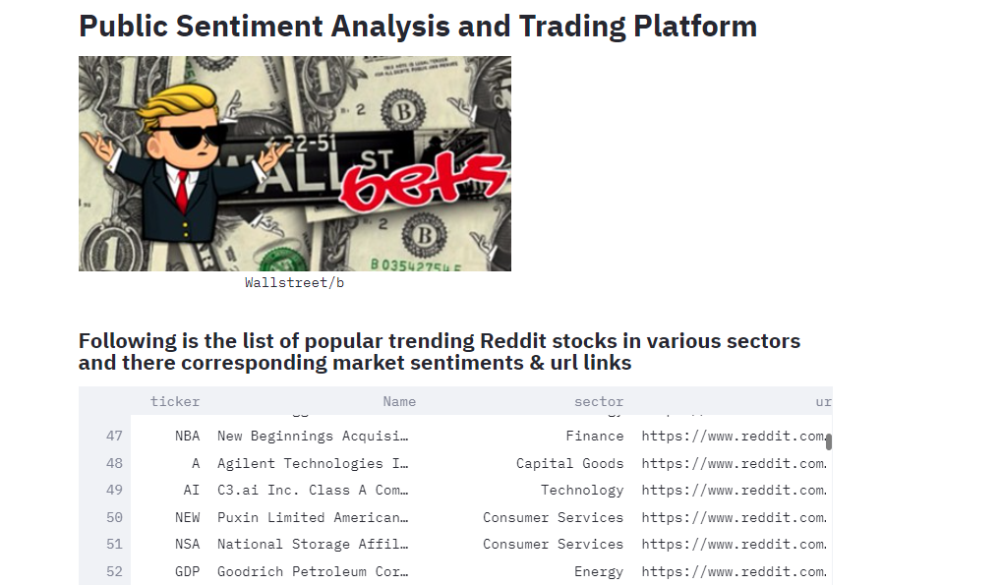

# Sentiment Analyzer

This startup is providing the more integrated platform combining public sentiment websites like Reddit, stock sites like Alpaca and trading platforms like Robinhood, so that an investor can get better unified insight into stocks before investing. The recent incident of Wall Street/ bet has onces again proved that public sentiments play a significant role in driving the market. Companies like AMC and Gamestop who were almost on the verge of bankruptcy were turned into multi-millionaire overnight just because few investors crazily pumped money into these stocks. 

Hence, our goal is to leverage public sentiments and feed that data into the ML model to quantify and predict overall market sentiments in order to make better decisions and then connect that to trading platforms to automate trades. We provide users better insight to the stocks and deeper analysis of public sentiments.


#Approach
The project takes raw comments from the site Reddit, stock prices from Alpaca and second part is to connect it to trading platform like Robinhood to auto trade. 

## Technologies

This project leverages python 3.7 with the following packages:

* [Pandas](https://pandas.pydata.org/) - For data cleaning, preparation and manipulation

* [Jupyter Notebook](https://jupyter.org/) - An open-source web application that allows you to create and share documents that contain live code, equations, visualizations and narrative text.

* [Visual Studio Code](https://code.visualstudio.com/) - A code editor redefined and optimized for building and debugging modern web and cloud applications

* [Pyviz](https://pyviz.org/) - Python visualization package that provides a single platform for accessing multiple visualization libraries. Two of these libraries are Plotly Express and hvPlot, which were used in this project

* [Flask](https://flask.palletsprojects.com/en/1.1.x/) - A Python library which allows you to build a web application


---

## Installation Guide

Download Anaconda for your operating system and the latest Python version, run the installer, and follow the steps.

Before running the application first install the following dependencies.

```python
  pip install fire
  pip install questionary
  pip install pytest
  pip install pandas
  pip install numpy
  pip install flask
  pip install hvplot
```

To install PyViz and its dependencies in your Conda dev environment, complete the following steps:

1. From your terminal, log in to your Conda dev environment.

2. Install the PyViz packages by using the conda install command as follows:
    
	conda install -c plotly plotly=4.13.
    
    conda install -c pyviz hvplot
-----------------------------------------------------------------------------------------------------------------------------------------------------

## Usage


The correlation metrics of ML results were interesting. Following were the findings (1) The result accuracy increased significantly with the incerease in the score of comments. Infact the weigtage of positive comments increased with more scores. (2) If there was a sudden percentage change in the stock 'close' price then weigtage of negative comments was more (3) The ML results from two different libraries have a strong  postive correlation.

--------------------------------------------------------------------------------------------------------------------------------------------


--------------------------------------------------------------------------------------------------------------------------------------------


--------------------------------------------------------------------------------------------------------------------------------------------


--------------------------------------------------------------------------------------------------------------------------------------------


--------------------------------------------------------------------------------------------------------------------------------------------


Due to the imbalanced dataset, we found more siginificant % percentage of neutral sentiments. The capital good sector % was 23%.

--------------------------------------------------------------------------------------------------------------------------------------------


The consumer service sector postive sentiment % is 23.2%

--------------------------------------------------------------------------------------------------------------------------------------------


The energy sector postive sentiment % is 14.1%


--------------------------------------------------------------------------------------------------------------------------------------------


The finance sector postive sentiment % is 22.6%

--------------------------------------------------------------------------------------------------------------------------------------------


The finance sector postive sentiment % is 10.1%

--------------------------------------------------------------------------------------------------------------------------------------------


The finance sector postive sentiment % is 10.1%

--------------------------------------------------------------------------------------------------------------------------------------------


The finance sector postive sentiment % is 10.1%

--------------------------------------------------------------------------------------------------------------------------------------------

This is the snapshot of the interactive dashboard built for the users to konw the sentiments for the particular stock before investing.
This shows the list of top trend in the market as per the recent data.



--------------------------------------------------------------------------------------------------------------------------------------------

This is the snapshot of the interactive dashboard built for the users to kn0w the sentiments for the particular stock before investing. 


--------------------------------------------------------------------------------------------------------------------------------------------


--------------------------------------------------------------------------------------------------------------------------------------------


--------------------------------------------------------------------------------------------------------------------------------------------


--------------------------------------------------------------------------------------------------------------------------------------------


--------------------------------------------------------------------------------------------------------------------------------------------


## Contributors

Brought to you by 
